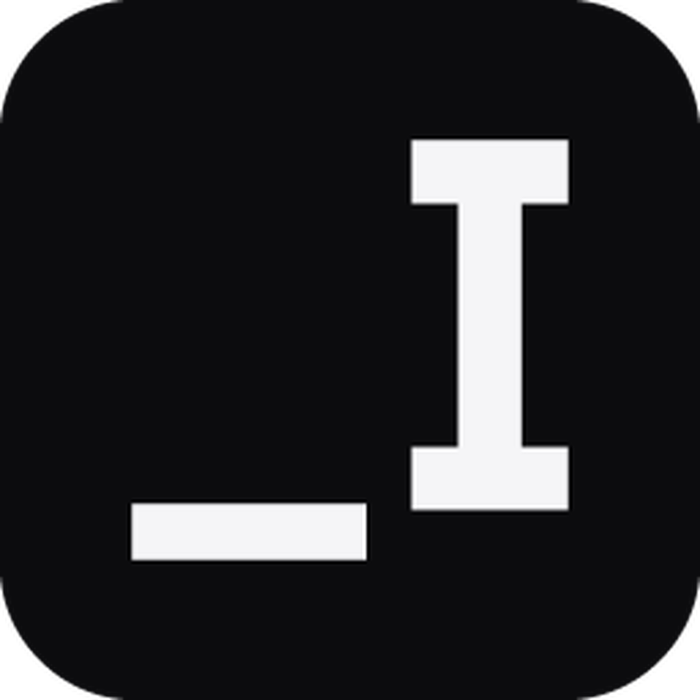

<div align="center">
  

# _davIMAGE

**Comprimi, converti e ottimizza immagini localmente, in modo veloce e sicuro.**  
**Compress, convert and optimize images locally, quickly and safely.**

Windows · macOS · Linux · Local-first · Open source

[](#-italiano)
[](#-english)

</div>

---

# 🇮🇹 Italiano

_davIMAGE è un'app desktop multipiattaforma di **_davstudios** pensata per comprimere, ridimensionare, convertire e ottimizzare immagini senza caricarle online.

L'idea è semplice: aggiungi una o migliaia di immagini, scegli lo strumento, controlli le impostazioni e avvii l'elaborazione. Tutto avviene **localmente sul computer**.

<p>
  <a href="https://www.davstudios.it"></a>
  <a href="https://buymeacoffee.com/davstudios"></a>
</p>

## Perché _davIMAGE

Molti servizi di conversione e compressione richiedono di caricare le immagini su un server. _davIMAGE nasce con un approccio diverso: elaborazione **locale**, batch processing e nessun account.

```text
3200 × 1800
2.7 MB JPEG

↓ Optimize for Web

1920 × 1080
WebP
output ottimizzato
```

### Funzioni principali

- selezione nativa di file e cartelle;
- drag & drop;
- scansione ricorsiva delle cartelle;
- elaborazione batch con coda e stato per file;
- compressione immagini;
- ridimensionamento per larghezza, altezza, percentuale, lato lungo/corto, Fit e Fill;
- preset per Full HD, 4K, Email, Avatar, Website e altri casi comuni;
- conversione tra JPEG, PNG, WebP, AVIF e TIFF;
- lettura BMP e conversione verso altri formati supportati;
- ritaglio e rotazione;
- watermark batch con immagine, opacità, dimensione e posizione configurabili;
- lettura metadata EXIF;
- rilevamento di fotocamera, obiettivo, data, GPS, software, copyright, orientamento e profilo ICC quando disponibili;
- preset **Optimize for Web**;
- riepilogo delle dimensioni prima e dopo l'elaborazione;
- annullamento dei job in esecuzione;
- naming sicuro dell'output senza sovrascrivere automaticamente gli originali;
- interfaccia in italiano e inglese;
- tema Sistema, Chiaro e Scuro.

> **Nota:** cambiare il formato tramite _davIMAGE esegue una vera conversione del contenuto del file. Gli originali non vengono sovrascritti automaticamente.

<details>
<summary><strong>Sicurezza dei file</strong></summary>

_davIMAGE è progettato per mantenere intatti i file originali.

Ogni operazione genera un nuovo file con un nome descrittivo:

```text
photo.jpg
→ photo-compressed.jpg
→ photo-resized.jpg
→ photo-converted.webp
→ photo-web.webp
```

Se un nome di destinazione esiste già, viene generato automaticamente un nuovo nome numerato invece di sovrascrivere il file esistente.

</details>

<details>
<summary><strong>Privacy e filosofia locale</strong></summary>

- nessun account;
- nessun upload delle immagini;
- nessuna elaborazione cloud;
- nessuna telemetria integrata;
- nessuna pubblicità;
- nessun limite artificiale al numero di file imposto dall'app.

Le immagini restano sul dispositivo durante l'intera elaborazione.

</details>

## Formati

| Formato | Input | Output | Stato |
| --- | :---: | :---: | --- |
| JPEG | ✅ | ✅ | Supportato |
| PNG | ✅ | ✅ | Supportato |
| WebP | ✅ | ✅ | Supportato |
| AVIF | ✅ | ✅ | Supportato |
| BMP | ✅ | — | Conversione verso altri formati |
| TIFF | ✅ | ✅ | Supportato |
| GIF | Rilevato | — | Elaborazione non disponibile |
| HEIC / HEIF | Rilevato | — | Supporto codec da estendere |

Le GIF animate vengono rilevate ma non elaborate per evitare la perdita dei fotogrammi. Il supporto HEIC/HEIF potrà essere esteso in aggiornamenti futuri.

## Optimize for Web

Il preset DAV per il web applica automaticamente una configurazione pensata per immagini moderne destinate a siti e applicazioni web:

- lato lungo massimo di 1920 px;
- orientamento EXIF applicato;
- conversione in WebP;
- qualità 82;
- output separato dall'originale.

## Piattaforme

| Sistema | Architettura | Pacchetto previsto |
| --- | --- | --- |
| Windows 10/11 | x64 | NSIS `.exe` |
| macOS | Intel + Apple Silicon | Universal `.dmg` |
| Linux | x64 | `.AppImage` / `.deb` |

Le build di release vengono generate tramite GitHub Actions sui rispettivi sistemi operativi.

## Installazione

Per gli utenti finali, scarica il pacchetto adatto al tuo sistema dalla sezione **Releases** del repository e avvialo normalmente. Non è necessario installare Node.js, Rust o clonare il codice sorgente.

## Sviluppo locale

Requisiti: Node.js, Rust e i prerequisiti Tauri del sistema operativo.

```bash
npm install
npm run desktop
```

Test:

```bash
npm test
```

Build locale:

```bash
npm run bundle
```

Gli artefatti vengono creati in `src-tauri/target/release/bundle/`.

## Tecnologia

_davIMAGE usa **Tauri 2** per l'app desktop, **Rust** per il backend e **JavaScript + Vite** per l'interfaccia. Il design e il motion system seguono l'identità visiva di `_davstudios` e condividono lo stesso linguaggio della suite `_dav`.

## Licenza

Distribuito con licenza **MIT**. Consulta [`LICENSE`](LICENSE).

### Supporta _davstudios

Se `_davIMAGE` ti è utile e vuoi sostenere lo sviluppo dei prossimi strumenti della suite, puoi offrirmi un caffè.

<p>
  <a href="https://buymeacoffee.com/davstudios"></a>
  <a href="https://www.davstudios.it"></a>
</p>

<div align="right"><a href="#davimage">↑ Torna all'inizio</a></div>

---

# 🇬🇧 English

_davIMAGE is a cross-platform desktop app by **_davstudios** designed to compress, resize, convert and optimize images without uploading them online.

The workflow is straightforward: add one image or thousands of them, choose a tool, review your settings and start processing. Everything stays **local on your computer**.

<p>
  <a href="https://www.davstudios.it/en"></a>
  <a href="https://buymeacoffee.com/davstudios"></a>
</p>

## Why _davIMAGE

Many online image conversion and compression services require files to be uploaded to a server. _davIMAGE takes a different approach: **local processing**, batch workflows and no account.

```text
3200 × 1800
2.7 MB JPEG

↓ Optimize for Web

1920 × 1080
WebP
optimized output
```

### Main features

- native file and folder selection;
- drag & drop;
- recursive folder scanning;
- batch processing with queue and per-file status;
- image compression;
- resize by width, height, percentage, longest/shortest side, Fit and Fill;
- presets for Full HD, 4K, Email, Avatar, Website and other common use cases;
- conversion between JPEG, PNG, WebP, AVIF and TIFF;
- BMP input with conversion to other supported formats;
- crop and rotation;
- batch watermarking with configurable image, opacity, size and position;
- EXIF metadata inspection;
- detection of camera, lens, date, GPS, software, copyright, orientation and ICC profile when available;
- **Optimize for Web** preset;
- before/after file-size summary;
- cancellation of running jobs;
- safe output naming without automatically overwriting original files;
- Italian and English interface;
- System, Light and Dark themes.

> **Note:** changing format in _davIMAGE performs an actual conversion of the file contents. Original files are not overwritten automatically.

<details>
<summary><strong>File safety</strong></summary>

_davIMAGE is designed to keep original files intact.

Each operation creates a new file with a descriptive suffix:

```text
photo.jpg
→ photo-compressed.jpg
→ photo-resized.jpg
→ photo-converted.webp
→ photo-web.webp
```

If an output name already exists, the app automatically generates a new numbered filename instead of overwriting the existing file.

</details>

<details>
<summary><strong>Privacy and local-first approach</strong></summary>

- no account;
- no image uploads;
- no cloud processing;
- no built-in telemetry;
- no ads;
- no artificial file-count limit imposed by the app.

Your images stay on your device throughout processing.

</details>

## Formats

| Format | Input | Output | Status |
| --- | :---: | :---: | --- |
| JPEG | ✅ | ✅ | Supported |
| PNG | ✅ | ✅ | Supported |
| WebP | ✅ | ✅ | Supported |
| AVIF | ✅ | ✅ | Supported |
| BMP | ✅ | — | Convert to another format |
| TIFF | ✅ | ✅ | Supported |
| GIF | Detected | — | Processing unavailable |
| HEIC / HEIF | Detected | — | Codec support to be extended |

Animated GIF files are detected but not processed to avoid frame loss. HEIC/HEIF support may be expanded in future updates.

## Optimize for Web

The DAV web preset automatically applies a configuration designed for modern website and web-app imagery:

- maximum 1920 px longest side;
- EXIF orientation applied;
- conversion to WebP;
- quality 82;
- output kept separate from the original file.

## Platforms

| System | Architecture | Planned package |
| --- | --- | --- |
| Windows 10/11 | x64 | NSIS `.exe` |
| macOS | Intel + Apple Silicon | Universal `.dmg` |
| Linux | x64 | `.AppImage` / `.deb` |

Release builds are generated through GitHub Actions on the corresponding operating systems.

## Installation

For end users, download the package for your operating system from the repository's **Releases** section and launch it normally. Node.js, Rust, and the source repository are not required to use a compiled release.

## Local development

Requirements: Node.js, Rust, and the Tauri prerequisites for your operating system.

```bash
npm install
npm run desktop
```

Tests:

```bash
npm test
```

Local build:

```bash
npm run bundle
```

Build artifacts are created under `src-tauri/target/release/bundle/`.

## Technology

_davIMAGE uses **Tauri 2** for the desktop application, **Rust** for the backend, and **JavaScript + Vite** for the interface. Its visual language and motion system follow the `_davstudios` identity and are shared across the `_dav` suite.

## License

Released under the **MIT License**. See [`LICENSE`](LICENSE).

### Support _davstudios

If `_davIMAGE` is useful to you and you would like to support the development of the next tools in the suite, you can buy me a coffee.

<p>
  <a href="https://buymeacoffee.com/davstudios"></a>
  <a href="https://www.davstudios.it/en"></a>
</p>

<div align="right"><a href="#davimage">↑ Back to top</a></div>
